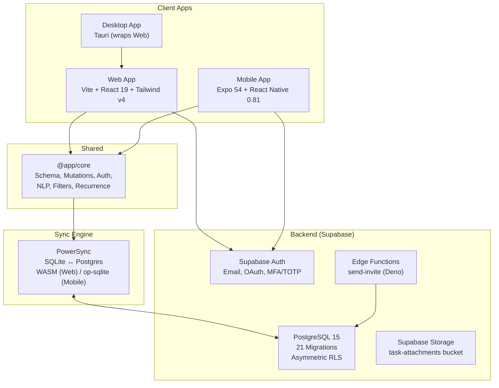

# 🔍 It Is Finished — Senior Engineering & Product Review

> **Reviewer**: Read-only audit · **Date**: 2026-08-31 · **Scope**: Full-stack codebase, security, architecture, product

---

## 1. Product Description & Architecture

**It Is Finished** (branded "Finished") is an offline-first, local-first productivity suite targeting power users who want sub-millisecond task management with cloud sync. It spans **three platforms** (Web, Mobile iOS, Desktop) from a single Turborepo monorepo.

### Core Architecture



**Key architectural decisions:**
- **Local-first**: All reads/writes go to local SQLite. PowerSync syncs bidirectionally with Supabase Postgres.
- **Asymmetric RLS**: `SELECT` queries use JWT claims for sub-ms edge reads; mutations use strict `EXISTS` checks for immediate revocation.
- **Tiered sync buckets**: Lightweight metadata for all workspaces syncs globally; heavy data (tasks, comments, attachments) syncs only for the active workspace.
- **SQLCipher encryption** (mobile): AES-256 at-rest encryption with 7-day heartbeat TTL for enterprise MDM compliance.
- **DAG upload queue**: Parent-child dependency tracking in the offline write queue prevents cascading foreign key failures.

---

## 2. Directory Map

```
It Is Finished/                          # Turborepo monorepo root
├── package.json                         # Workspaces: apps/*, packages/*
├── turbo.json                           # Build/dev/lint/typecheck task config
├── ROADMAP.md                           # 8-stage product roadmap
├── to-do.md                             # Detailed architecture implementation tracker
├── AI_HANDOFF.md                        # iOS build guide for Mac Mini
├── IOS_MAC_MINI_BUILD_GUIDE.md          # Duplicate of AI_HANDOFF.md
│
├── check_profiles.js                    # ⚠️ Debug script (Supabase RPC calls)
├── check_pub.js                         # ⚠️ Debug script
├── fix_inserts.js                       # ⚠️ One-time migration script
├── fix_workspace_ui.js                  # ⚠️ One-time migration script
├── test_logs.js                         # ⚠️ Debug script
├── null                                 # ⚠️ Junk file (0 bytes)
│
├── apps/
│   ├── web/                             # Vite SPA (React 19, Tailwind v4)
│   │   ├── .env                         # ⚠️ Real Supabase keys (not in git)
│   │   ├── .env.local                   # ⚠️ Override keys (not in git)
│   │   ├── vercel.json                  # SPA rewrite rules
│   │   ├── vite.config.ts               # React + Tailwind + PowerSync WASM
│   │   └── src/
│   │       ├── main.tsx                 # SQLite WASM init → PowerSyncContext
│   │       ├── App.tsx                  # Router: / (landing), /app/* (workspace)
│   │       ├── index.css                # Tailwind v4 base + dark scrollbar
│   │       ├── lib/
│   │       │   ├── powersync.ts         # Supabase client + PowerSync DB init
│   │       │   ├── auth.ts              # AuthManager singleton
│   │       │   └── expose.ts            # ⚠️ Debug: window.__DEBUG_*
│   │       ├── hooks/useAuth.ts         # Auth state + MFA + sign-out
│   │       ├── pages/
│   │       │   ├── Workspace.tsx        # 🔴 1,302 lines — God component
│   │       │   └── SettingsPage.tsx     # Settings + 2FA + preferences
│   │       └── components/              # 18 components (297–745 lines each)
│   │
│   ├── mobile/                          # Expo 54 / React Native 0.81
│   │   ├── app.json                     # Bundle ID: com.finished.app
│   │   ├── app/
│   │   │   ├── _layout.tsx              # Root: GestureHandler + AppProvider
│   │   │   └── (tabs)/                  # 5 tabs: Today, Calendar, Habits, Matrix, Focus
│   │   └── src/
│   │       ├── lib/
│   │       │   ├── powersync.ts         # SQLCipher + op-sqlite init
│   │       │   ├── SupabaseConnector.ts # DAG cascading skip upload queue
│   │       │   ├── WorkspaceContext.tsx  # Global auth + workspace + TTL
│   │       │   ├── sqlcipher.ts         # Encryption key + 7-day TTL
│   │       │   └── imageCompressor.ts   # expo-image-manipulator
│   │       └── components/              # 12 components (322–710 lines each)
│   │
│   └── desktop/                         # Tauri shell (wraps web/dist)
│       └── tauri.conf.json              # Window config, global shortcut, tray
│
├── packages/
│   └── core/                            # @app/core — shared business logic
│       ├── src/
│       │   ├── schema.ts                # PowerSync SQLite schema (17 tables)
│       │   ├── types/database.ts        # Full Supabase type definitions
│       │   ├── connector.ts             # PowerSync ↔ Supabase sync connector
│       │   ├── auth.ts                  # AuthManager (email, OAuth, MFA/TOTP)
│       │   ├── mutations.ts             # Zod-validated pure SQLite mutations
│       │   ├── nlp.ts                   # Quick-add NLP parser (chrono-node)
│       │   ├── filters.ts              # Smart filter SQL compiler + evaluator
│       │   ├── indexing.ts              # Fractional ordering (Figma-style)
│       │   ├── media.ts                 # Attachment validation + tier limits
│       │   ├── presence.ts              # Realtime presence tracker
│       │   └── recurrence.ts            # RRULE evaluation engine
│       └── dist/                        # tsup build output (CJS + ESM)
│
├── powersync/
│   └── sync_rules.yaml                  # 3-bucket tiered sync strategy
│
└── supabase/
    ├── config.toml                      # Project config (jwt_expiry: 3600)
    ├── migrations/                      # 21 SQL migrations
    │   ├── 20260828000000_initial_schema.sql    # Core tables + RLS
    │   ├── 20260828000001_storage_setup.sql     # Attachments + Storage bucket
    │   ├── 20260828000002_focus_and_filters.sql # Focus sessions + saved filters
    │   ├── 20260829000000_settings_expansion.sql # Profile preferences
    │   ├── 20260830000000–000011_*.sql          # Workspace isolation arc (12 files)
    │   ├── 20260831000000_jwt_claims.sql        # JWT workspace claims trigger
    │   ├── 20260831000001_asymmetric_rls.sql    # Asymmetric RLS policies
    │   ├── 20260831000002_workspace_invites.sql # Invite system + signup trigger
    │   ├── 20260831000003_workspace_isolation.sql # time_blocks/focus isolation
    │   └── 20260831000004_auto_provisioning.sql # SECURITY DEFINER fix
    └── functions/
        └── send-invite/index.ts         # Deno: Resend email + state machine
```

---

## 3. Build, Lint & Test Commands

### What exists

| Command | Script | Status |
|---------|--------|--------|
| `npm run dev` | `turbo dev` | ✅ Starts web + mobile |
| `npm run build` | `turbo build` | ✅ Builds core → web |
| `npm run typecheck` | `turbo typecheck` | ✅ `tsc --noEmit` in web + mobile |
| `npm run format` | `prettier --write` | ✅ Formatter only |
| Mobile start | `cd apps/mobile && expo start` | ✅ |
| Core build | `cd packages/core && tsup` | ✅ |

### What's missing

| Gap | Impact |
|-----|--------|
| **No ESLint config** anywhere | `turbo lint` runs but has nothing to execute |
| **No test runner** (jest, vitest, playwright) | Zero automated tests across entire codebase |
| **No `.env.example`** files | New developers cannot set up without guessing |
| **No CI/CD pipeline** | No GitHub Actions, no automated checks before merge |
| **No `lint` script** in any `package.json` | The turbo `lint` task is a no-op |
| **No pre-commit hooks** | No husky/lint-staged for quality gates |
| **`delete_user` RPC** referenced but never defined in migrations | Account deletion will fail at runtime |

---

## 4. Code Quality & Maintainability Review

### 🔴 Critical

| # | Issue | Location | Impact |
|---|-------|----------|--------|
| 1 | **God Component**: [Workspace.tsx](file:///c:/Users/admin/Documents/It%20Is%20Finished/apps/web/src/pages/Workspace.tsx) is **1,302 lines** — sidebar, task list, quick-add, drag-drop, view switching, project CRUD, section CRUD, filter logic, tab routing all in one file | `apps/web/src/pages/` | Unmaintainable; impossible to test in isolation; merge conflicts guaranteed |
| 2 | **Zero automated tests** | Entire repo | No regression protection; no refactoring confidence; blocks CI/CD |
| 3 | **Massive component duplication** between web and mobile — `KanbanBoardView`, `WeeklyReviewModal`, `FocusTimer`, `ProjectMembersModal`, `HabitsTracker`, `EisenhowerMatrix` all reimplemented | `apps/web/src/components/` vs `apps/mobile/src/components/` | Double maintenance burden; features drift apart |

### 🟠 High

| # | Issue | Location | Impact |
|---|-------|----------|--------|
| 4 | **No error boundaries** in React tree | Both apps | Uncaught render error crashes entire app |
| 5 | **No ESLint** — unused imports, inconsistent patterns undetected | Root | Code quality will degrade as team grows |
| 6 | **Debug scripts committed** to root: `check_profiles.js`, `fix_inserts.js`, `fix_workspace_ui.js`, `test_logs.js`, `check_pub.js` | Repo root | Pollutes repo; confusing for new devs; security risk |
| 7 | **`null` file** exists at repo root | Root | Artifact of a bug or redirect; should be removed |
| 8 | **Duplicate docs**: `AI_HANDOFF.md` and `IOS_MAC_MINI_BUILD_GUIDE.md` are identical (same byte count) | Root | Confusing; which is canonical? |

### 🟡 Medium

| # | Issue | Location | Impact |
|---|-------|----------|--------|
| 9 | **No code-splitting / lazy loading** — all 18 web components are eagerly imported in Workspace.tsx | Web app | Slower initial load; unnecessary JS parsed |
| 10 | **Hardcoded mock data** in mobile calendar (team members "Alex", "Sarah", "David") | `apps/mobile/app/(tabs)/calendar.tsx` | Confusing UX; not connected to real data |
| 11 | **SettingsModal.tsx** has stub "Preferences" tab saying "More settings coming soon!" while `SettingsPage.tsx` has real preferences | Web app | Two competing settings UIs |
| 12 | **No shared UI component library** — colors, spacing, button styles duplicated everywhere | Both apps | Inconsistent design; wasted effort |

---

## 5. Security Findings

### 🔴 Critical

| # | Finding | Severity | Location |
|---|---------|----------|----------|
| **S1** | **Debug SECURITY DEFINER RPCs in production** — `debug_get_profiles()`, `debug_get_workspaces()`, `debug_get_workspace_members()` bypass ALL RLS and return complete table dumps. Any authenticated user can call `supabase.rpc('debug_get_profiles')` to read every user's data. | **CRITICAL** | [20260830000006_debug_bypass_rls.sql](file:///c:/Users/admin/Documents/It%20Is%20Finished/supabase/migrations/20260830000006_debug_bypass_rls.sql) |
| **S2** | **`delete_user` RPC is called but never defined** — the migration for account deletion doesn't exist. If someone creates it as `SECURITY DEFINER` without proper guards, it could be weaponized to delete other users' accounts. | **CRITICAL** | [SettingsModal.tsx:27](file:///c:/Users/admin/Documents/It%20Is%20Finished/apps/web/src/components/SettingsModal.tsx#L27) |
| **S3** | **Debug globals exposed in production** — `window.__DEBUG_POWERSYNC`, `window.__DEBUG_SUPABASE`, `window.__DEBUG_CONNECTOR` expose the full Supabase client (including auth tokens) to browser console. Any XSS or browser extension can extract active sessions. | **HIGH** | [expose.ts](file:///c:/Users/admin/Documents/It%20Is%20Finished/apps/web/src/lib/expose.ts) |

### 🟠 High

| # | Finding | Severity | Location |
|---|---------|----------|----------|
| **S4** | **`supabase/config.toml` has `jwt_expiry = 3600`** (1 hour) but documentation says it should be 900s (15 min). Local dev environment diverges from production intent, and there's no validation that production matches. | HIGH | [config.toml:34](file:///c:/Users/admin/Documents/It%20Is%20Finished/supabase/config.toml#L34) |
| **S5** | **No rate limiting on auth endpoints** — magic link, signup, and password reset have no client-side throttling. Combined with no server-side rate limits (default Supabase), this enables email enumeration and spam. | HIGH | `@app/core/src/auth.ts` |
| **S6** | **Workspace invite RPC (`invite_user_to_workspace`) doesn't validate email format** — the RPC checks role membership but accepts any string as email, which could be exploited for spam or injection into the Resend API. | HIGH | [20260831000002_workspace_invites.sql](file:///c:/Users/admin/Documents/It%20Is%20Finished/supabase/migrations/20260831000002_workspace_invites.sql) |
| **S7** | **Soft-delete leaks** — PowerSync `sync_rules.yaml` filters `WHERE deleted_at IS NULL`, but `habit_logs` and `task_tags` have no `deleted_at` filter. Deleted data remnants may sync to other devices. | HIGH | [sync_rules.yaml:37-38](file:///c:/Users/admin/Documents/It%20Is%20Finished/powersync/sync_rules.yaml#L37-L38) |

### 🟡 Medium

| # | Finding | Severity | Location |
|---|---------|----------|----------|
| **S8** | **`debug_logs` table** with exception stack traces exists in production schema — could leak internal error information. | MEDIUM | `20260830000005_fix_trigger_search_path.sql` |
| **S9** | **No Content Security Policy** headers configured (no Vercel headers, no meta tags). | MEDIUM | `apps/web/vercel.json`, `index.html` |
| **S10** | **Edge function hardcodes `invites@itisfinishedapp.com`** as sender — if domain DNS/SPF isn't configured, emails will land in spam. | MEDIUM | `supabase/functions/send-invite/index.ts` |

---

## 6. Performance, Accessibility, Mobile UX, Error Handling, Observability

### Performance

| Issue | Impact | Location |
|-------|--------|----------|
| No `React.lazy()` / code splitting | ~300KB+ JS parsed on first load for unused views | `Workspace.tsx` imports |
| No pagination on task queries | `SELECT * FROM tasks WHERE workspace_id = ?` will degrade with thousands of tasks | `sync_rules.yaml`, Workspace queries |
| PowerSync WASM excluded from `optimizeDeps` | Cold start ~500ms for SQLite WASM init (acceptable but could be preloaded) | `vite.config.ts` |
| No image lazy loading or CDN | Attachment thumbnails loaded eagerly | Components |

### Accessibility

| Issue | Impact |
|-------|--------|
| **Dark-mode only** — `<html class="dark">` hardcoded, `userInterfaceStyle: "dark"` in app.json | Users with light-mode preference or visual impairments have no recourse |
| No ARIA labels on interactive elements | Screen readers cannot parse the task list, modals, or drag-drop zones |
| No keyboard navigation support for web | Power users cannot navigate without mouse |
| No focus management on modal open/close | Tab order breaks when modals overlay |
| Color-only priority indicators (P1=red, P2=yellow...) without text/shape differentiation | Inaccessible to colorblind users |

### Mobile UX

| Issue | Impact |
|-------|--------|
| Calendar screen uses hardcoded team member data, not real workspace members | Misleading UI; users see phantom collaborators |
| No pull-to-refresh on any tab | Users can't manually trigger sync |
| No offline indicator banner | Users don't know when they're working offline |
| No haptic feedback on task completion in list view (only swipe) | Inconsistent tactile feedback |

### Error Handling & Observability

| Issue | Impact |
|-------|--------|
| No error boundaries (`ErrorBoundary` component) | Single render crash takes down entire app |
| No structured logging (no Sentry, no LogRocket, no custom logger) | Production crashes invisible |
| `catch (err: any)` pattern throughout — errors logged to `console.error` and discarded | No user-facing error recovery |
| No health check endpoint | Cannot monitor service status |
| `debug_logs` table is only observability, and it's a security risk itself | Inadequate |

---

## 7. Technical Debt & Duplication

### Duplicated Code (estimated ~4,000 lines duplicated)

| Component | Web (lines) | Mobile (lines) | Overlap |
|-----------|-------------|-----------------|---------|
| KanbanBoardView | 425 | 710 | ~70% logic duplication |
| WeeklyReviewModal | ~280 | 566 | ~80% logic duplication |
| FocusTimer/View | 368 | 430 | ~60% logic duplication |
| ProjectMembersModal | ~200 | 430 | ~50% logic duplication |
| HabitsTracker | 406 | ~350 | ~70% logic duplication |
| EisenhowerMatrix | ~250 | ~250 | ~80% logic duplication |

### Technical Debt Register

| Debt Item | Cost of Carry | Notes |
|-----------|---------------|-------|
| 12 debug/fix migrations (000004–000011) left in history | Low | Can't remove from history but they bloat schema understanding |
| Root-level `.js` debug scripts | Low | Should be in a `scripts/` dir or removed |
| `SettingsModal` vs `SettingsPage` competing implementations | Medium | Users may encounter both |
| Mobile screens have significant mock/hardcoded data | High | Calendar, members not wired to real DB |
| No shared type-safe API contract between edge functions and client | Medium | `send-invite` response shape not typed |
| `Workspace.tsx` coupling — sidebar, content, modals, drag-drop all interleaved | Very High | Any feature addition requires touching 1,300-line file |

---

## 8. Product Critique

### Strengths
- **Genuinely impressive feature scope** for an early-stage product: Eisenhower matrix, Kanban, calendar time-blocking, NLP quick-add, habits, focus timer, recurring tasks, subtasks, smart filters, weekly review wizard, and real-time collaboration — all offline-first.
- **The NLP quick-add parser** is a legitimate differentiator. `"Buy groceries p1 tomorrow for 30m #Personal @errands every week"` parsing entirely client-side at 0ms is powerful.
- **Architecture is sophisticated** — asymmetric RLS, tiered PowerSync buckets, DAG upload queue, SQLCipher TTL — this is enterprise-grade infrastructure.

### User Friction & Missing Flows

| Issue | Impact | Suggestion |
|-------|--------|------------|
| **No onboarding** — new users land in an empty workspace with no guidance | High churn risk | Add a first-run tutorial or sample project |
| **No search** — no way to find tasks by text across projects | Major gap for power users | Full-text search over local SQLite |
| **No undo/redo** — destructive actions (delete task, complete) are immediate | Anxiety-inducing | Toast with "Undo" for soft-delete window |
| **No notification/reminder system** — due dates exist but nothing alerts the user | Core feature gap | Push notifications (mobile), browser notifications (web) |
| **7 navigation tabs on web** (Today, All, Calendar, Matrix, Analytics, Focus, Habits) | Cognitive overload | Consider grouping or progressive disclosure |
| **No data export** — users can't extract their data | Trust barrier for adoption | CSV/JSON export |
| **Landing page NLP demo** doesn't connect to signup | Missed conversion | Add CTA: "Try it free — your first task is already created" |
| **"Plan My Day" wizard** (mobile-only) is not available on web | Feature gap | Port to web |
| **Invite flow endpoint** sends to `itisfinishedapp.com/invite?token=...` but no `/invite` route exists in the web app router | Broken flow | Add invite acceptance page |

---

*See the companion [claude-roadmap.md](file:///C:/Users/admin/.gemini/antigravity/brain/c10620e4-9608-461f-9e26-3a318503ba6e/claude-roadmap.md) for the prioritized roadmap and implementation tickets.*
