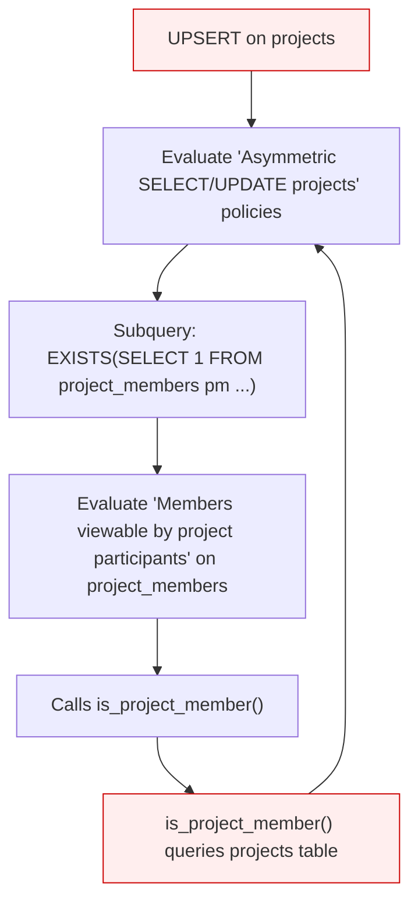
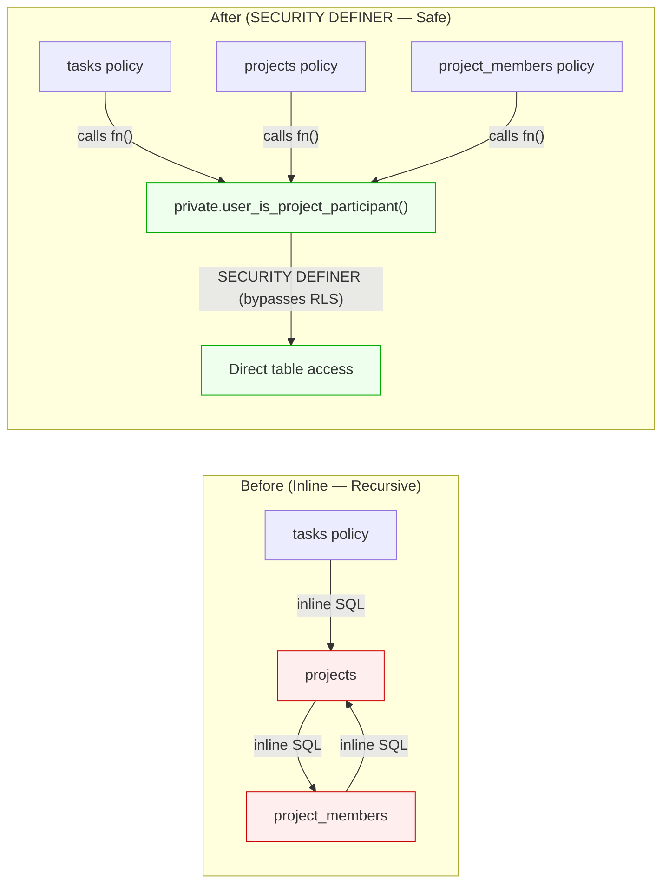

# RLS Infinite Recursion — Independent Review

## The Incident


**Summary**: Every `POST /rest/v1/projects` returns HTTP 500. Postgres error `42P17`: _"infinite recursion detected in policy for relation 'projects'"_ (and sporadically `'workspace_members'`). The Data API has a 100% failure rate.

---

## Root Cause

### The Smoking Gun: A Forgotten Policy

The `"Members viewable by project participants"` policy on `project_members` was created in the initial schema migration ([20260828000000_initial_schema.sql](file:///c:/Users/admin/Documents/It%20Is%20Finished/supabase/migrations/20260828000000_initial_schema.sql#L286-L288)) and **has never been dropped or replaced by any subsequent migration**:

```sql
-- Created in 20260828000000_initial_schema.sql, line 286
CREATE POLICY "Members viewable by project participants" ON project_members
    FOR SELECT TO authenticated
    USING (is_project_member(project_id, auth.uid()));
```

The [`is_project_member()`](file:///c:/Users/admin/Documents/It%20Is%20Finished/supabase/migrations/20260828000000_initial_schema.sql#L248-L257) function queries **both** `projects` and `project_members`:

```sql
CREATE OR REPLACE FUNCTION is_project_member(p_id UUID, u_id UUID)
RETURNS BOOLEAN AS $$
BEGIN
    RETURN EXISTS (
        SELECT 1 FROM projects WHERE id = p_id AND owner_id = u_id
    ) OR EXISTS (
        SELECT 1 FROM project_members WHERE project_id = p_id AND user_id = u_id
    );
END;
$$ LANGUAGE plpgsql SECURITY DEFINER;
```

> [!IMPORTANT]
> While `is_project_member()` is `SECURITY DEFINER` (which bypasses RLS), the critical fact is that **it queries `projects`**. When called from within a `project_members` policy, this creates a cross-table cycle that PostgreSQL's recursion detector catches.

### The Recursion Chain

Here is exactly what happens during a PostgREST UPSERT (`INSERT ... ON CONFLICT DO UPDATE`) on `projects`:



1. **UPSERT on `projects`** → PostgreSQL evaluates SELECT + UPDATE + INSERT policies on `projects`
2. **`"Asymmetric SELECT projects"` policy** (from [20260908000003](file:///c:/Users/admin/Documents/It%20Is%20Finished/supabase/migrations/20260908000003_member_restrictions.sql#L71-L80)) contains: `EXISTS (SELECT 1 FROM project_members pm WHERE pm.project_id = projects.id ...)`
3. **SELECT on `project_members`** triggers the `"Members viewable by project participants"` policy
4. **That policy** calls `is_project_member()`, which queries **`projects`** — right back to step 1
5. **`42P17` — infinite recursion detected**

### Why This Wasn't Always Broken: The Timeline

| Date | Migration | Effect |
|------|-----------|--------|
| Aug 28 | [initial_schema.sql](file:///c:/Users/admin/Documents/It%20Is%20Finished/supabase/migrations/20260828000000_initial_schema.sql#L286-L288) | Creates `"Members viewable by project participants"` on `project_members` using `is_project_member()` — **latent bug planted** |
| Aug 31 | [asymmetric_rls.sql](file:///c:/Users/admin/Documents/It%20Is%20Finished/supabase/migrations/20260831000001_asymmetric_rls.sql#L4-L18) | Drops all old policies on `projects` (but **NOT** on `project_members`!). New `projects` SELECT uses JWT-only: `workspace_id = ANY(auth_user_workspace_ids())` — no subquery into `project_members`, so **recursion stays dormant** |
| Sep 8 | [member_restrictions.sql](file:///c:/Users/admin/Documents/It%20Is%20Finished/supabase/migrations/20260908000003_member_restrictions.sql#L71-L80) | **Re-introduces** `project_members` subqueries into `projects` policies to enforce role-based access for workspace members — **RECURSION ACTIVATED** |
| Sep 9 | [fix_all_rls_recursions.sql](file:///c:/Users/admin/Documents/It%20Is%20Finished/supabase/migrations/20260909000000_fix_all_rls_recursions.sql#L61-L63) | Fixes `project_members` FOR ALL (INSERT/UPDATE/DELETE) recursion, but **does NOT touch the SELECT policy** — the actual offender |

> [!CAUTION]
> The [asymmetric_rls.sql](file:///c:/Users/admin/Documents/It%20Is%20Finished/supabase/migrations/20260831000001_asymmetric_rls.sql#L14) migration drops policies from this list: `'tasks', 'projects', 'sections', 'comments', 'attachments', 'tags', 'habits', 'habit_logs', 'saved_filters', 'task_tags'`. Notice that **`project_members` is not in this list**. This omission is why the original self-referencing SELECT policy survived across 47 migrations.

### The `workspace_members` Recursion (Secondary)

The sporadic `workspace_members` errors in the logs (appearing only at `22:00:14`, mixed with `projects` errors) are likely triggered through a secondary path during the same UPSERT:

1. The `trg_projects_status_gate` trigger fires on the INSERT, calling `enforce_workspace_status_gate()`
2. This function (which is **NOT** `SECURITY DEFINER`) queries `workspaces`
3. The `workspaces` SELECT policy calls `private.user_belongs_to_workspace()` (which **is** `SECURITY DEFINER`)
4. Under normal conditions this path is safe. But during the UPSERT, PostgreSQL's planner may merge the policy evaluation contexts, and the recursion detector — already primed from the `projects → project_members → projects` cycle — may flag `workspace_members` as a participant in the cycle

---

## Assessment of the Previous Gemini Diagnosis

| Claim | Verdict |
|-------|---------|
| The recursion involves `projects` → `project_members` → back | ✅ Correct |
| The trigger `enforce_workspace_status_gate` contributes to the recursion | ⚠️ Misleading — the trigger is a separate concern; the primary recursion is purely in the policy chain |
| `SECURITY DEFINER` functions might "not be fully bypassed" | ❌ Incorrect — `SECURITY DEFINER` always bypasses RLS. The issue isn't that it fails to bypass; it's that the `is_project_member()` function (which IS `SECURITY DEFINER`) queries `projects`, creating a cross-table cycle that the recursion detector catches at the policy level |
| The `project_members` SELECT policy self-references | ⚠️ Imprecise — the policy doesn't directly self-reference `project_members`. It calls `is_project_member()` which queries **`projects`**, and then `projects`' policy queries back into `project_members`. It's a 2-hop cycle, not a 1-hop self-reference |
| Proposed fix: wrap everything in SECURITY DEFINER | ✅ Right technique, but overcomplicated — creates 4+ new functions when the fix can be much simpler |

---

## Recommended Fix

> [!IMPORTANT]
> The minimum fix is a **single policy replacement**. Drop the forgotten `"Members viewable by project participants"` policy and replace it with one that doesn't create a cross-table cycle.

### Option A: Minimal Fix (Recommended for Immediate Hotfix)

```sql
-- Drop the recursive policy that was never replaced
DROP POLICY IF EXISTS "Members viewable by project participants" ON public.project_members;

-- Replace with a workspace-scoped policy that doesn't query `projects`
CREATE POLICY "Members viewable by project participants" ON public.project_members
FOR SELECT TO authenticated
USING (
    -- Admins/owners of the workspace can see all project members
    EXISTS (
        SELECT 1 FROM public.projects p
        WHERE p.id = project_members.project_id
        AND p.workspace_id = ANY(auth_user_workspace_ids())
    )
);
```

Wait — this still queries `projects`, which could trigger `projects` policies, which query `project_members`. We need to use a `SECURITY DEFINER` function to break the cycle cleanly:

```sql
-- 1. Create a SECURITY DEFINER helper
CREATE OR REPLACE FUNCTION private.user_can_view_project_member(
    _project_id UUID, _u_id UUID
)
RETURNS BOOLEAN
LANGUAGE plpgsql
SECURITY DEFINER
SET search_path = ''
STABLE
AS $$
BEGIN
    RETURN EXISTS (
        SELECT 1 FROM public.projects
        WHERE id = _project_id AND owner_id = _u_id
    ) OR EXISTS (
        SELECT 1 FROM public.project_members
        WHERE project_id = _project_id AND user_id = _u_id
    );
END;
$$;

REVOKE ALL ON FUNCTION private.user_can_view_project_member(UUID, UUID) FROM public, anon;
GRANT EXECUTE ON FUNCTION private.user_can_view_project_member(UUID, UUID) TO authenticated;

-- 2. Replace the policy
DROP POLICY IF EXISTS "Members viewable by project participants" ON public.project_members;
CREATE POLICY "Members viewable by project participants" ON public.project_members
FOR SELECT TO authenticated
USING (private.user_can_view_project_member(project_id, auth.uid()));
```

This is essentially the same logic as the original `is_project_member()` function, but placed in the `private` schema with proper `SET search_path = ''` isolation. The key difference is that the original `is_project_member()` — despite being `SECURITY DEFINER` — was being called from within a policy on `project_members`, and its subquery into `projects` triggered `projects`' policies (which query `project_members`), creating the cross-table cycle. With a properly isolated `SECURITY DEFINER` function in the `private` schema, the internal queries bypass RLS entirely, breaking the cycle.

### Option B: Defense-in-Depth (Recommended for Follow-Up)

After the hotfix, also wrap the `projects` policy subqueries in SECURITY DEFINER functions (as Gemini proposed). This prevents future regressions if anyone adds another policy on `project_members` that references `projects`:

```sql
CREATE OR REPLACE FUNCTION private.user_is_project_participant(
    _p_id UUID, _u_id UUID
) RETURNS BOOLEAN
LANGUAGE plpgsql SECURITY DEFINER SET search_path = '' STABLE
AS $$
BEGIN
    RETURN EXISTS (
        SELECT 1 FROM public.projects WHERE id = _p_id AND owner_id = _u_id
    ) OR EXISTS (
        SELECT 1 FROM public.project_members
        WHERE project_id = _p_id AND user_id = _u_id
    );
END;
$$;

-- Then use it in the projects policies:
-- USING (
--   workspace_id = ANY(auth_admin_workspace_ids())
--   OR (
--     workspace_id = ANY(auth_member_workspace_ids())
--     AND private.user_is_project_participant(id, auth.uid())
--   )
-- )
```

---

## Summary

| | Gemini Diagnosis | My Assessment |
|---|---|---|
| **Root cause** | Multiple interconnected recursions | Single root cause: the `"Members viewable by project participants"` policy on `project_members` was never replaced across 47 migrations |
| **Why now?** | Not explained | [member_restrictions.sql](file:///c:/Users/admin/Documents/It%20Is%20Finished/supabase/migrations/20260908000003_member_restrictions.sql) (Sep 8) re-introduced `project_members` subqueries into `projects` policies, activating a latent bug from day 1 |
| **Fix scope** | 4+ new SECURITY DEFINER functions | 1 function + 1 policy replacement (minimum), with optional defense-in-depth |
| **Technique** | ✅ Correct (SECURITY DEFINER) | ✅ Same technique, narrower scope |

---

## Resolution

### Phase 1: Targeted Fix (Partially Successful)

**Migration**: [20260910000000_fix_project_members_rls_recursion.sql](file:///c:/Users/admin/Documents/It%20Is%20Finished/supabase/migrations/20260910000000_fix_project_members_rls_recursion.sql)

We replaced the forgotten `"Members viewable by project participants"` SELECT policy on `project_members` with one backed by a `SECURITY DEFINER` function (`private.user_can_view_project_member()`).

**Result**: This fixed the `projects` recursion — the `42P17` errors on `POST /rest/v1/projects` stopped. However, the error **shifted** to `POST /rest/v1/tasks` with `infinite recursion detected in policy for relation "project_members"`.

**Why it wasn't enough**: The recursion problem was wider than just the `project_members` SELECT policy. The policies on `tasks`, `sections`, `comments`, and `attachments` (from [member_restrictions.sql](file:///c:/Users/admin/Documents/It%20Is%20Finished/supabase/migrations/20260908000003_member_restrictions.sql)) ALL contain **inline** `EXISTS (SELECT 1 FROM projects p ... EXISTS (SELECT 1 FROM project_members pm ...))` subqueries. PostgreSQL's query rewriter expands these inline subqueries and applies RLS to each referenced table. Even though the `project_members` SELECT policy now uses a `SECURITY DEFINER` function, the rewriter still detects a dependency cycle in the overall query tree because `projects` and `project_members` keep referencing each other through different inline paths.

### Phase 2: Comprehensive Fix (Deployed)

**Migration**: [20260910000001_eliminate_all_rls_cycles.sql](file:///c:/Users/admin/Documents/It%20Is%20Finished/supabase/migrations/20260910000001_eliminate_all_rls_cycles.sql)

The fundamental insight: **every cross-table reference between `projects` and `project_members` in any RLS policy must go through a `SECURITY DEFINER` function**. No inline subqueries crossing this boundary may exist anywhere.

#### New SECURITY DEFINER Functions

Five helper functions were created in the `private` schema. All use `SECURITY DEFINER SET search_path = '' STABLE` to bypass RLS and prevent search-path attacks:

| Function | Checks | Used By |
|----------|--------|---------|
| `private.user_is_project_participant(project_id, user_id)` | Project owner OR any `project_members` row | `project_members` SELECT, `projects` SELECT, `sections` SELECT, `tasks` SELECT |
| `private.user_is_project_editor(project_id, user_id)` | Project owner OR `project_members` with role `editor`/`admin` | `projects` UPDATE, `sections` INSERT/UPDATE/DELETE, `tasks` INSERT/UPDATE/DELETE |
| `private.user_is_project_admin(project_id, user_id)` | Project owner OR `project_members` with role `admin` | `projects` DELETE |
| `private.user_can_access_via_task(task_id, user_id)` | Resolves task → project → participant check | `comments` SELECT/INSERT, `attachments` SELECT |
| `private.user_can_edit_via_task(task_id, user_id)` | Resolves task → project → editor check | `attachments` INSERT/UPDATE/DELETE |

#### Policies Rewritten

**22 policies** were dropped and recreated across 6 tables. Every policy now follows the same clean pattern:

```sql
-- Before (inline subqueries — causes recursion)
CREATE POLICY "Asymmetric SELECT tasks" ON tasks FOR SELECT TO authenticated
USING (
  workspace_id = ANY(auth_admin_workspace_ids())
  OR (
    workspace_id = ANY(auth_member_workspace_ids()) AND EXISTS (
      SELECT 1 FROM projects p 
      WHERE p.id = tasks.project_id AND (
        p.owner_id = auth.uid() OR
        EXISTS (SELECT 1 FROM project_members pm 
                WHERE pm.project_id = p.id AND pm.user_id = auth.uid())
      )
    )
  )
);

-- After (SECURITY DEFINER function — no recursion possible)
CREATE POLICY "Asymmetric SELECT tasks" ON tasks FOR SELECT TO authenticated
USING (
  workspace_id = ANY(auth_admin_workspace_ids())
  OR (
    workspace_id = ANY(auth_member_workspace_ids())
    AND private.user_is_project_participant(project_id, auth.uid())
  )
);
```

#### Tables Affected

| Table | Policies Rewritten | Notes |
|-------|-------------------|-------|
| `project_members` | SELECT | The original trigger of the incident |
| `projects` | SELECT, INSERT, UPDATE, DELETE | INSERT was already safe (no `project_members` ref) but rewritten for consistency |
| `sections` | SELECT, INSERT, UPDATE, DELETE | Had `projects p JOIN project_members pm` inline |
| `tasks` | SELECT, INSERT, UPDATE, DELETE | Had `projects p JOIN project_members pm` inline |
| `comments` | SELECT, INSERT | UPDATE/DELETE only check `user_id = auth.uid()`, no cross-table refs |
| `attachments` | SELECT, INSERT, UPDATE, DELETE | Had `tasks t JOIN projects p JOIN project_members pm` inline |

#### Why This Works



All cross-table access is funneled through `SECURITY DEFINER` functions that query tables **directly without RLS**. No policy on any table references another table's data through an inline subquery. PostgreSQL's rewriter never sees a circular dependency because the function calls are opaque to the policy evaluation engine.

#### Commits

| Commit | Description |
|--------|-------------|
| `7a228fa` | Phase 1: targeted `project_members` SELECT fix + workspace data leakage fixes |
| `68fbb69` | Phase 2: comprehensive rewrite of all 22 policies across 6 tables |

### Lessons Learned

> [!WARNING]
> **Never use inline cross-table subqueries in RLS policies.** If policy on table A needs to check data in table B, and table B has its own policies that could reference table A (directly or transitively), PostgreSQL will detect the cycle and raise `42P17`. Always wrap cross-table checks in `SECURITY DEFINER` functions.

> [!TIP]
> **When bulk-dropping old policies, enumerate ALL tables.** The [asymmetric_rls.sql](file:///c:/Users/admin/Documents/It%20Is%20Finished/supabase/migrations/20260831000001_asymmetric_rls.sql#L14) migration listed 10 tables but omitted `project_members`. This single omission left a stale policy alive across 47 subsequent migrations, creating a latent bug that took 12 days to detonate.
